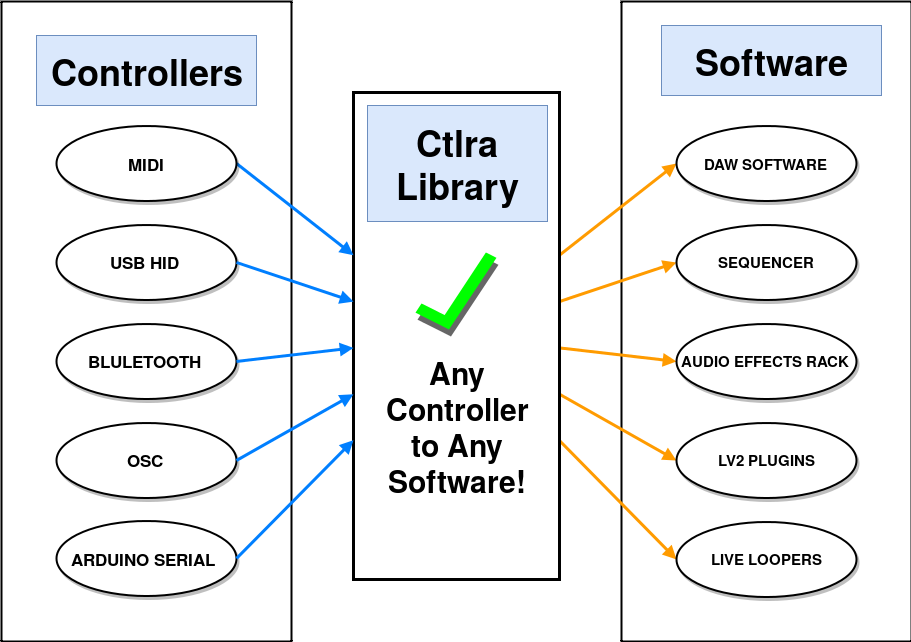
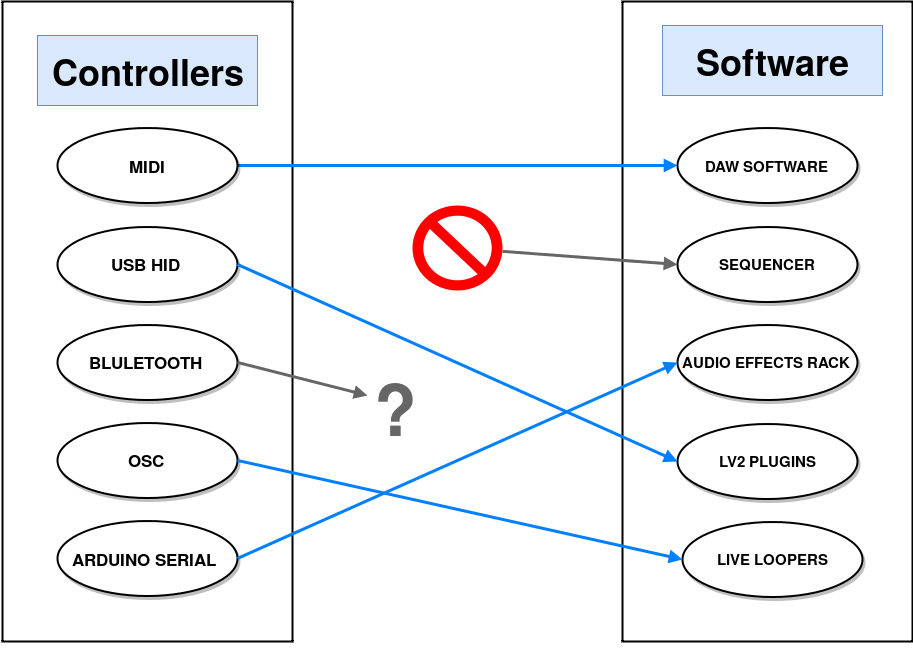

.. image:: img/ctlra/code.jpg
   :align: right
   :scale: 15 %

########
Ctlra
########

Ctlra is a software library that allows developers to integrate hardware
controllers (like MIDI or USB HID devices) easily. The library provides
generic events, which can be easily mapped to functionality in the software
providing tight integration between the physical device and the software
in question.

.. note:: The source code is available from the `Ctlra page on Github`_
	but the DAW or software you want to use Ctlra with must already
	integrate the Ctlra source code. If you want to use Ctlra,
	ask the developers of your favorite software if they
	have integrated Ctlra into their application.

.. _Ctlra page on Github: https://github.com/openAVproductions/openAV-Ctlra/

____

Users and Developers
====================

The open-source audio world is amazing in that it allows the users and
developers of audio software to be directly in contact - improving and
integrating ideas at an extremely fast-pace. But some features just can't
be developed without *physical* access to a controller.

This is one area where open-source audio is not particularly capable -
providing powerful integration between software and hardware. Although
techincally possible to achieve anything, often this requires more than
basic software-development skills from musicians to achieve. The Ctlra
library addresses this by exposing hardware in a generic way, so when a
developer integrates Ctlra support and tests it using a device they
have physical access to, then the user should be able to use their
controller with the software too!

Concept
=======

This section decsribes the concept behind the ctlra library, as displayed
visually on the right hand side.

.. TODO::
	Do a single image with the difference of yes/no ctlra lib

Subheading
----------

Stuff

____

Conclusion
==========

Ctlra is a library to enable powerful interactions beween software and
hardware controllers. It is designed to allow "techie-musicians" customize
and change the mappings from the physical controls to the software in the
way that lets them do the coolest and most crazy stuff!
