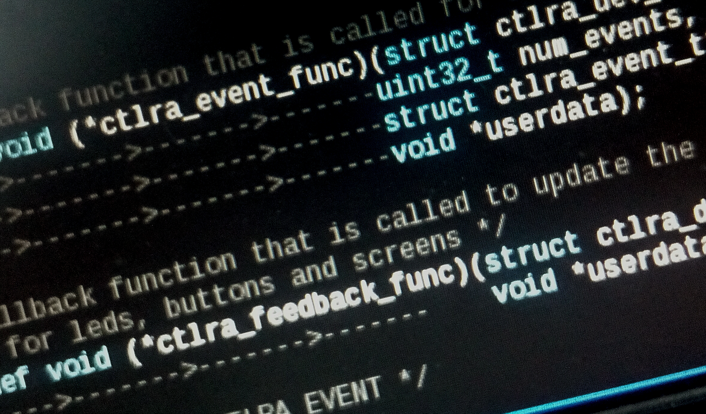
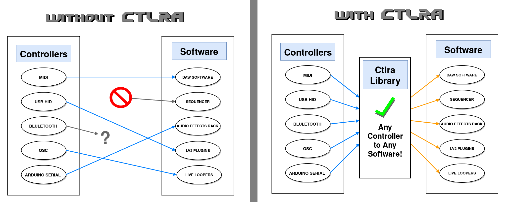

########
Ctlra
########

Ctlra is a software library that allows developers to integrate hardware
controllers (like MIDI or USB HID devices) easily. The library provides
generic events, which can be easily mapped to functionality in the software
providing tight integration between the physical device and the software
in question.

.. note::
	The source code is available from the `Ctlra page on Github`_
	but the DAW or software you want to use Ctlra with must already
	integrate the Ctlra source code. If you want to use Ctlra,
	ask the developers of your favorite software if they
	have integrated Ctlra into their application.

.. _Ctlra page on Github:
	https://github.com/openAVproductions/openAV-Ctlra/

____

Users and Developers
====================

The open-source audio world is amazing in that it allows the users and
developers of audio software to be directly in contact - improving and
integrating ideas at an extremely fast-pace. But some features just can't
be developed without *physical* access to a controller.

This is one area where open-source audio is not particularly capable -
providing powerful integration between software and hardware. Although
techincally possible to achieve anything, often this requires more than
basic software-development skills from musicians to achieve. The Ctlra
library addresses this by exposing hardware in a generic way, so when a
developer integrates Ctlra support and tests it using a device they
have physical access to, then the user should be able to use their
controller with the software too!

Concept
-------

The concept behind the Ctlra library is simple: to enable *all* controllers
on *all* software. But there's a price to pay for such flexibility:

 * Controllers need support in the Ctlra library
 * Software (DAWs mostly) needs to support Ctlra
 * A Ctlra mapping from Controller and Software (+ vice versa)

A graphical summary of what Ctlra achieves:

____

____

Physical Devices
----------------

Ctlra allows access to any type of device in theory. The library is
currently focussed towards USB HID devices, as this reflects the current
industry trend of creating powerful music-oriented controller devices.

In order for a device to be supported, a "driver" must be implemented. This
driver is just plain C code that reads messages from the device, interprets
the bits and bytes, and provides the physical changes (eg: button presses)
as generic events to the application.

This driver implementation effort *must* be done once for each device -
it simply cannot be avoided. Keep in mind that without the Ctlra library
this driver would have to be implemented *for device in every DAW*! (So by
doing this work once in the Ctlra library, we're really saving effort when
we look at the community level.

Software (DAWs etc)
-------------------

In order to use the Ctlra library, DAWs must use the Ctlra library. This is
a requirement, and again cannot be easily avoided. Ctlra has been designed
to be easy to integrate, however if a DAW really isn't designed for events,
then it could be difficult. Again - this *must* be done, there is no
avoiding it. If the DAW doesn't support events easily, then that *same*
problem would exists if the DAW wanted to support any device directly
without Ctlra. At community level we gain from developers
supporting the Ctlra library instead of a specific device, because their
effort enables the whole range of Ctlra supported devices.

Mappings
--------

Mappings - this is the part that will be done by *you* - the user of the
DAW, and the owner of a Ctlra supported device! What this means is that you
"map" (connect) events from the hardware controller, to actions in the
software. Before you run away screaming - give me 5 minutes of your time to
convince you of the advantages of doing the mappings yourself.

 * You will understand *exactly* how the controller maps to the software
 * Every control will do *exactly* what you want
 * Customize the parameter ranges to exactly how you like them
 * You will learn about the DAW software you are using
 * You will understand how the software works better
 * You can share and download others mapping files

These all allow you to better integrate *your* workflow for *your* type of
music, so you can perform on-stage how *you* want to. You own the control
over your DAW - because you are the person who created the mapping.

Creating a custom mapping
=========================

OK - the `Mappings`_ section above convinced you that creating your own
mapping is worth it,  great. Now lets get to the details! This section may
require some learning, so don't rush it - be patient, and don't be afraid
to ask for help from a techie friend, or the various mailing-lists and user
groups!

Lets start small, understanding the events coming from your hardware
device, and gradually work towards integrating your hardware in your DAW.
(If you would like to dive right in and map a device to your DAW, please
check your DAW for a tutorial or documentation to help you).

Running the "Simple" Ctlra app
------------------------------

In order to understand the hardware you are working with, we will run the
simple application, which comes with the Ctlra library. This application
does nothing, only prints out the names of the event that is sent when
you press a specific button or move a control on the hardware.

.. TODO::
	Write a detailed section on running the simple app, checking if
	there is a supported device found, and then showing the user how to
	actually get events running in a terminal.

Simply A Single Event
---------------------

This section will show you how to identify a single event from your
hardware controller, and then "act" on specifically that control.
This is the basis for mapping each and every control for the whole physical
device.
If you are not familiar with programming basics, give yourself time here.
It is *not* insanely difficult - but it *does* take a little time to
understand.

*IGNORE* the first two lines. They're complicatied, and *NOT* the core of
what we're looking at here!

.. code-block:: C

 void only_one_event_func(struct ctlra_dev_t* dev, uint32_t num_events,
   struct ctlra_event_t** events, void *userdata)
 {
	// Get the first available event
	struct ctlra_event_t *e = events[0];

 	if(e->type == CTLRA_EVENT_BUTTON &&
 	   e->button.id == 1) {
 		// This code *ONLY* runs when we have a button press of the
 		// button identified as button #1 on the hardware!
 		printf("Whoooo Button #1!\n");
	}
 }

The above "function" (chunk of code) is *valid* and will select only the
button press of the control marked as physical button #1. The first two
lines are details, and not require to understand right now. The important
parts are understanding that the ``ctlra_event_t`` represents the event
itself, and the name of that event is ``e``.

When we type ``e->type``, we are saying "take the event, and look at the
type". The most common event types are BUTTON and SLIDER.  Similarly,
``e->button.id`` takes the event, examines the "button" part of the event,
and tells us the ID of the button.

Multiple Event Types
--------------------

The above is the very smallest simplest way of dealing with an event - it
does not scale well to complex controllers! In order to write a complex
mapping with > 40 buttons, and > 10 sliders, we need a better approach.

.. TODO::
	Write a section on handling multiple event *types* here

Writing Feedback Mappings
=========================

Feedback to the device (LEDs, motorized faders etc), is done approximately
the same as the input mappings as described in `Simply A Single Event`_
above. The main difference is that now we read a value (known as the
"state") from the DAW (is Record enabled?) and want to show that value on
the hardware.

First of all, we must decide on the state. Then we must write that state
to the device, targetting the correct LED or light.

.. TODO::
	Write a section on how to write a feedback binding, with simple
	example for a LED based on a static assigned int?

Conclusion
==========

Ctlra is a library to enable powerful interactions beween software and
hardware controllers. It is designed to allow "techie-musicians" customize
and change the mappings from the physical controls to the software in the
way that lets them do the coolest and most crazy stuff!

PS: If you're not a techie musician, check if there is a local computer
club, or community who are interested in programming - it is likely that
they could help you if you find the mappings too technical.
