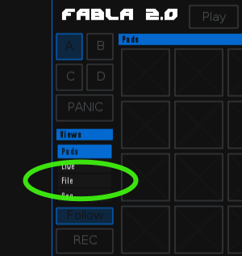

.. _fabla2:

#######
Fabla2
#######

Fabla2 is a drum sampler :ref:`lv2_plugin` instrument. It is ideal for
loading up your favorite sampled sounds and bashing away on a MIDI
controller. Or if it’s crafty beat programming your after that’s cool too!

The next section introduce the features that Fabla2 has, how to record your
own drum sounds, create professional-sounding multi-layered kits,
and use advanced features like OpenAV's :ref:`auxbus`.

.. _fabla2_features:

Features
==========

Fabla 2.0 has all of the "normal" features you've come to expect of a
professional software sampler. Some examples are multi-layer support,
banks, ADSRs, start and end points, volume controls... but Fabla2 provides
more than this! With AuxBus sends, per-voice FX and an intuitive interface,
Fabla2 becomes a live-performance sampler with huge improvements in
features and workflow compared to a simple sampler like Fabla 1.0.

Internal Effects
----------------
.. note::
	The internal FX is a work-in-progress feature of Fabla2, and may
	be disabled in your current version. When testing is complete, it
	will be enabled by default.

Fabla2 has internal effects that run *per voice*. This means that if one
audio sample is played twice, any FX will be running twice, independantly.
Although the sample data is constant, the sound is different because
the FX parameters may have changed, keeping the listener interested.

SVF Filter
~~~~~~~~~~
Each voice has a :abbr:`SVF (State Variable Filter)` filter capable of
highpass, lowpass and bandpass.  This filter can be set to a specific
frequency, or can be dynamically adjusted by the velocity of the MIDI
note-on event.

Distortion
~~~~~~~~~~
Theres very little as good a spicing up a few samples as some old-school
crunchyness - and this distortion is well capable of destroying audio.

AuxBus
------
The :ref:`auxbus` feature is an advanced and complex tool - but it also provides
very flexible routing and awesome musical configurability. If you are
familiar with routing of audio-signals, and want to understand more of what
the auxbus feature can offer you, read the AuxBus Integration section.

____

.. _fabla2_creating_kits:

Creating Kits
=============
This section introduces how to create your own drumkits with Fabla2. First
the basics are introduced - loading single samples, and levelling the
volume. The following sections show how to set up multi-layer samples,
use the FX sends, and show examples.

Building a Basic Kit
--------------------
For this tutorial, we rebuild a basic drum kit using "one-shot" samples.
The samples we will use have been recorded by OpenAV, and can be
downloaded from `this link on the OpenAV website
<http://openavproductions.com/downloads/savageDrums.zip>`_. The .zip
contains a simple kick drum, hi-hats, snare and a ride cymbal.

____

Loading Samples
~~~~~~~~~~~~~~~
Launch Fabla2 as described in the beginners guide :ref:`launching_a_plugin`
section. When the interface opens, click the pad you want to load a sample
to. Now we're going to click the "File" button, browse to the location
where your have samples, and select a sample filename to audition it.

Click on a different pad, and load another sample. Keep the layout of the
samples logical, particularly if you use a MIDI keyboard or drum-pad to
trigger notes. When all samples are loaded, continue to set the volume
levels.

____

Setting Volume Levels
~~~~~~~~~~~~~~~~~~~~~
How to use the Live view to adjust the volume levels.

.. note::

  The audio can be amplified as well as attenuated - if all controls are
  turned up, the audio will become very loud and distroted!

Multi-layered Kits
------------------
How to multi-layer, different sample types (none, round robin, and
velocity-layers),

.. _fabla2_manipulating_samples:

Manipulating Samples
====================
How can F2 manipulate audio that's recorded?
* Filters
* Other FX
* AuxBus FX sends
* Velocity -> Volume mapping?
* Other mappings?
