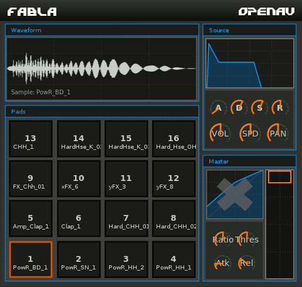

.. image:: img/fabla/fabla.png
   :align: right
   :scale: 50 %

########
Fabla
########

Fabla est un instrument échantillonneur de batterie en greffon LV2. Il est idéal pour charger vos sons favoris et les balancer avec votre contrôleur MIDI. Ou, si vous cherchez à programmer des rythmes artisanaux, c'est bien aussi ! L'enveloppe ADSR permet de dessiner les contours des charlestons et des grosses caisses pendant que le compresseur renforce le son des grosses caisses lancinantes.

.. note:: Le code source est disponible sur la `page github de Fabla`_
	mais votre gestionnaire de paquet en un certainement un déjà pré-compilé !

.. _Fabla page on Github: https://github.com/openAVproductions/openAV-Fabla/

____

Échantillonnage
===============

Fabla est un échantillonneur simple, qui charge un fichier audio (.wav ou similaire) et
peut le rejouer lorsque des notes MIDI lui sont envoyées. Fabla ne possède pas de
fonctionnalités extraordinaires comme des couches, des effets par PAD, ou un routage avancé.
OpenAV travaille sur Fabla2, qui possédera de telles fonctionnalités, cependant, ce n'est pas
encore prêt pour être utilisé par des musiciens.

Pour créer des batteries électroniques ou des types de musique utilisant énormément les échantillons comme
le hip-hop, le reggae, et la dnb, les fonctionnalités de Fabla sont suffisantes pour créer de la musique. Si
vous souhaitez simuler des batteries acoustiques, DrumGizmo est le greffon à utiliser, ou Hydrogen si vous
cherchez une application autonome.

Pads
----

Fabla utilise le concept de pads pour charger les échantillons audio. Il y a 16 pads dans
la vue principale de Fabla, chacun d'entre eux peut charger un unique échantillon .wav. Pour
charger un échantillon, cliquez-droit sur le pad, et naviguer jusqu'à l'échantillon que vous voulez
charger. Fabla chargera le fichier à partir du disque, et un clic sur le pad
résultera à présent avec la lecture de l'échantillon. L'affichage de la forme d'onde en haut
affichera la forme d'onde de l'échantillon qui vient d'être joué à l'instant.

ADSR
----

L'ADSR disponible en haut à droite de l'interface graphique premet de dessiner l'enveloppe
de chaque pad. Lorsque vous cliquez sur un pad, l'ADSR affiche le pad actuellement sélectionné
en orange (voir l'animation GIF à droite). Lorsque vous cliquez sur de nouveaux pads, l'ADSR
se met à jour pour contrôler cet échantillon.

Pré-réglages
============

Fabla supporte les pré-réglages à travers l'extension "LV2 State", qui est supporté par
la plupart des hôtes LV2. Si vous avez un pré-réglage (avec des échantillons partageables
et libres de droit) et que vous voudriez les contribuez à OpenAV, veuillez `prendre contact`_!

Actuellement, Fabla fourni quatre pré-réglages :
 * fablaHardElectro
 * fablaSavageDrums
 * fablaEasternHop
 * fabla808

Conclusion
==========

Fabla est un outil capable de lire des échantillons, et permet la création de
beats électroniques ainsi que l'échantillonnage de contenu existant et l'arrangement
en des nouveaux morceaux.
Si vous appréciez Fabla, que vous êtes un geek et que vous êtes intéressé par Fabla2, il est
possible de compiler le code source de Fabla2 et de le tester vous-même ! Pour toute question,
veuillez `contacter`_ OpenAV et nous essaierons de vous aider autant qu'on le peut !

.. _get in contact: http://openavproductions.com/contact

