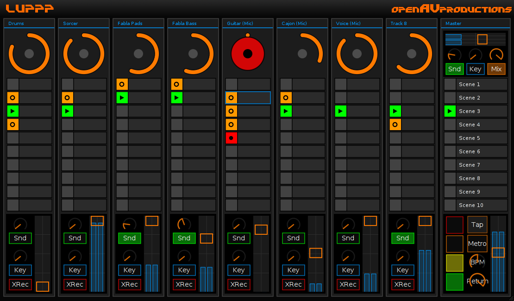
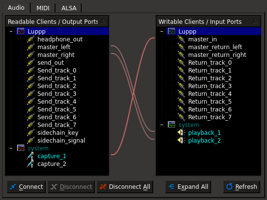
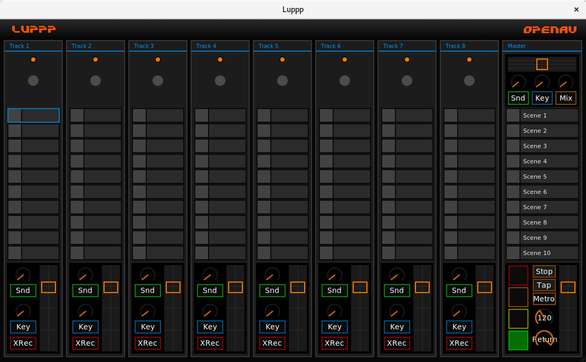
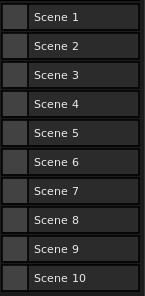
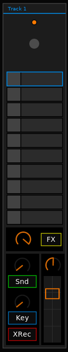
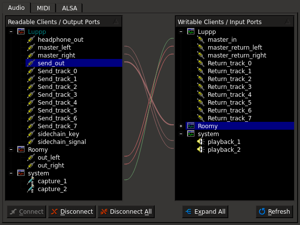
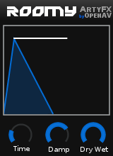
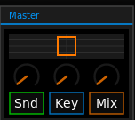
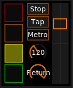

########
Luppp
########

Luppp is a music creation tool, intended for live use. The focus is on real
time processing and a fastintuitive workflow. With extensive MIDI mapping
support, you can get looping just how you like! The next sections will show
you how to set up Luppp with JACK for audio input and output, and introduce
the concepts of "Scenes" and "Clips" to let you start arranging your
creativity for live performances!

Luppp and JACK
==============

If you are totally new to JACK and Luppp, this is an example video that
shows what a typical Luppp looping session looks like:
https://www.youtube.com/watch?v=R6WiWDDKRCQ

Before we can record we need to connect some audio source to Luppps
master_in and connect master_right and master_left to the output jacks
of the system. See screenshot of the connections:

Next we will take a look at the Luppp interface, which may seem complex at
the start, but really it's quite simple once we understand what each part of
the UI does.

You can see 8 Tracks with each 10 Clips. To check if your setup work
just play your audio source and you should see the amplitude of the audio
on the top right meter. If this works, you are ready to go!

Now click on a Clip to start recording and click again to start looping!
All actions of Luppp are synced to the Beat, which is indicated by the four
squares on the bottom right of the window. You can change the tempo by
turning the knob with the BPM number (which should be 120 by default).

Scenes 
======

A pretty important concept of Luppp are the scenes. On each track you can
just play one clip at the same time. In the master section of Luppp you can
see a list of Scenes. You can launch a scene by clicking on
it. When you do this, all clips in this row start at the same time.

.. Tip::
   When you use clips with a length higher than one bar, be careful to
   start the recording at the same time when other clips in the row are
   starting. If not, launching a scene will create a little mess ;)

-----

Tracks
======

All tracks of Luppp have some controllers to do incredible things. I will
walk through them from top to bottom. At first, there is the name of the
track. You can change it by right-clicking on it. Below this,
there is a circle showing the progress of the playing loop in the track.
It's pretty useful to look at it when recording other clips in the same row.
The next thing to come are the clips. You can give them a name with a right
click, too. They also show the currect status of a clip, if it's recording,
playing or empty. On the buttom is a fader, which adjust the volume of the
track mixed to the master. Around the faders there are some controls
we look at in the next sections.

.. Tip::
	You can use your keyboard, to control the clips! The first scene
	are the numbers from 1-8, 9 triggers the first scene. The following
	rows are binded to the subjacent scenes. Just try!

-----

Panning
=======

Before we get into the world of processing in Luppp, let’s look on a pretty
basic but powerful feature. It is introduced by version 1.1.1: The Panning.
The knob above the fader of each track can split the signal to the two master 
channels as you want. So you have the possibility to give each channel a place
in the master mix. This is pretty simple, so let’s move on …

FX Section
==========

The first controls below the clip section are the effect section. In your 
JACK connection manager of your choice you will notice the Send_track_X and
Return_track_X ports. Connecting the send to the input of a JACK client and the
output back to the returns of Luppp will send the audio through this other JACK client.
To enable the processing, click on the yellow FX Button. With the knob you can
adjust the volume of the effect.
This feature gives you endless possibilities. You could add as many effects as
you want in any order. Just be creative!

Reverb Send
===========

This feature gives you the great possibility to simply add some reverb on a
track. Before we can try, we need to connect Luppps send_out to a reverb of
our choice (e. g. :ref:`roomy`) and the outputs of the reverb back to Luppps
master_returns. If it's done, we can enable the reverb for each track with
the Snd-Button and adjust the amount of reverb with the above knob. 

The connections for a reverb send are as follows:

And the recommended Roomy settings are shown here - the most important part
is to set the Dry/Wet dial to 100% Wet, as then only the reverb is output,
and the original signal is totally muted. Given that Luppp is already
outputting the original signal, we do not want the reverb to also do that!

There is a video about this topic, too: https://www.youtube.com/watch?v=wLy9oG_WpHg

-----

Sidechaining
============

Using Luppp it's very easy to use sidechaining, for example to create some
house bass lines.. It's a pretty simple concept: you use one audio signal to
control the processing of another signal. This processing could be a
compressor or an enveloper (e. g. :ref:`ducka`). So, how to use it? At first
we again need to do some connections. Luppps sidechain_key needs to be
connected to a sidechain input and Luppps sidechain_signal needs to be
connected to the regular audio inputs of the :ref:`ducka` JACK client.
Send the outputs of the Ducka JACK client to the master returns.

Back to Luppp. On one track you need to enable the Key-Button. This way the
output of the track is the trigger for the sidechain effect. Now you can
send each track with the knob above the Key-Button to JACK. If you
want to see how it's works, watch these videos: 

* Explanation: https://www.youtube.com/watch?v=-AwtMUeBc9w
* Showcase: https://www.youtube.com/watch?v=bPJQs6w2XQc

Input Section
=============

At the beginning of this tutorial we connected an audio source to Luppps master_in. 
You can input several different sources, or any output of a mixer or what ever you can 
imagine! In the top right corner of the GUI you can see the Luppp Input Section.

.. Tip ::
	Luppp only has a mono input. If you want to connect a stereo source like a synthesizer, 
	there are severel possibilities. In the most cases it's enough to connect just one side since 
	there are equal or similar. If you need both sides, consider a mixer to mix them together.
	But there might be some trouble if you simply connect both to the input port.

Here you have a meter, and a fader to adjust the volume of the input. The knobs below
do the following:

* Snd-Button activates the Send
* Knob above sets the amount, e. g. Reverb
* Key-Button sets the input as Key-Signal for Sidechaining 
* Knob above the Key-Button how much of the input goes to the Sidechain-Signal
* Mix-Button activates the routing of the input to the master outs of Luppp
* Knob above the Mix-Button sets amount of the input on the master outs.

So you have great possibilities here: a little reverb on the input, using an
input for a special sidechaining key? Easy! You can monitor what you play just with 
Luppp and adjust the recorded volume to fit with the other tracks.

Master Section
==============

Let’s take a look at the last part of the GUI: the master section. The function of the most elements
are quite obvious, so i will only explain them in short:

* the green, yellow, orange and red square show the beat (from bottom to top)
* the Stop/Play button stops or restarts the transport
* with the tap button you can adjust the tempo by clicking the beat
* the metro button activates a metronom on the headphones_out of Luppp (note that you can choose between a selection of different volume levels by right-clicking on the "metro" button)
* the knob with the number sets the tempo
* the return knob adjusts the volume of the returned audio (e. g. reverb)
* the fader adjusts the master volume

Saving and Loading Sessions
===========================

.. image:: img/luppp/luppp_load.png
   :align: right

Loading and saving is done by using the "Luppp" titled menu on the
top left. Clicking the "Luppp" word opens the menu, allowing to control
the session (New, Load, Save), setup controllers, and quit the program.

-----

Configuration
=============

Luppp provides some configuration features in a file under the user's
config directory. It allows setting some options apart from the GUI.

The file to edit is ``~/.config/openAV/luppp/luppp.prfs`` which uses the
`JSON <https://en.wikipedia.org/wiki/Json>`_ format.

The default content looks like this::

    {
        "saveDirectory":                "luppp",
        "resampleQuality":              1,
        "defaultControllers":           [],
        "enablePerTrackSendReturns":    0
    }

Save Directory
--------------

The option ``saveDirectory`` defines the directory where sessions are stored.
The path is relative to the user’s home directory and defaults to ``luppp``::

    "saveDirectory": "luppp"

Resample Quality
----------------

The quality for resampling can be defined with the ``resampleQuality`` key.
Possible values are:

* 0 = LINEAR
* 1 = SINC_FASTEST
* 2 = SINC_BEST

The default value is ``SINC_FASTEST`` (``1``)::

    "resampleQuality": 1,

Default Controllers
-------------------

The ``defaultControllers`` option allows to specify which controllers are
loading automatically at startup. Note that multiple controllers can be added,
listed as separate strings with a comma inbetween::

    "defaultControllers": ["akai_apc.ctlr", "launchpad_s.ctlr"]

Enable Per Track Send/Returns
-----------------------------

The option ``enablePerTrackSendReturns`` controls if send/return channels will
be enabled for each track. A value of ``0`` disabled, ``1`` enables it::

    "enablePerTrackSendReturns": 0
