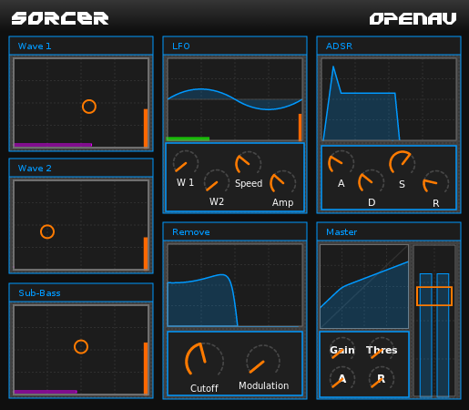
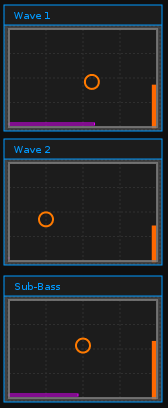
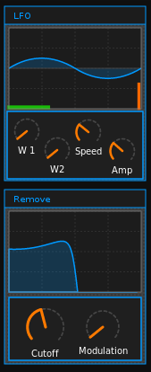
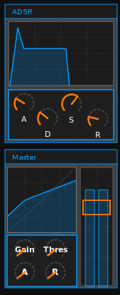

########
Sorcer
########

Sorcer is a polyphonic wavetable synth LV2 plugin. Its sonic fingerprint is
one of harsh modulated sub-bass driven walls of sound. Two morphing
wavetable oscillators and one sine oscillator provide the generation
routines. The LFO can be mapped to wavetable modulation as well as filter
cutoff. An ADSR allows for shaping the resulting sound, while a master
volume finishes the signal chain. Easily creating a variety of dubstep
basslines and harsh pad sounds.

.. note:: The source code is available from the `Sorcer page on Github`_
	but your package manager probably has a pre-compiled version!

.. _Sorcer page on Github: https://github.com/openAVproductions/openAV-Sorcer/

____

Oscillators
===========

Oscillators are the sound generators in most synths - Sorcer is no
different. Sorcer has 3 oscillators, two "Wave" oscillators that use
wavetables to generate audio, and one "Sub-Bass" sine-wave oscillator.

Wave oscillators allow fading between two timbres by moving the X/Y pad
in a horizontal direction. Vertically moving changes the volume of the
oscillator.  The sub-bass oscillator only has a volume - it always plays a
sine-wave, as this is the lowest frequency possible.

Wavetables
----------
Wavetables are short recordings of a single-cycle off sound. This allows
the synth to repeatedly play the same cycle of audio, and create a
continuous tone which has a specific timbre due to the harmonics in the
recorded audio.

Sorcer has four wavetable recordings; and uses two per wavetable
oscillator. The recordings are carefully chosen to have similar sound
characteristics, that when faded between cause a nice spectral transition.

Aliasing and Artifacts
----------------------
Note that wavetable synthesis generally has some side effects. Playing a
sample back at a different rate (altering the speed) creates some
artifacts. With playback rates close to :abbr:`unity(The playback rate of 1,
also the original playback rate)` these artifacts can be audible unless
some :abbr:`interpolation(smoothing of audio data based on the
playback rate)` is done.

Aliasing can be avoided by interpolation, or careful pre-processing of
the recorded waveform. As pitch goes up harmonics can be removed from the
signal, which avoids aliasing. In its current state, Sorcer does not do
either of interpolation of the waveform or pre-processing of the waveform.

Why not just fix the Aliasing?
------------------------------
Although possible to add, it would change the sound of Sorcer - and change
any existing songs that have written. For that reason, Sorcer will not see
any improvements in its playback engine - but fear not - OpenAV has plans
to release new synths in the future with alias-avoidance and more capable
modulation than Sorcer ever had!

____

Envelopes and Modulation
========================
Sorcer also has some modulation and enveloping features, an LFO can
modulate the filter and wavetables, while the ADSR allows controlling the
volume per-note. Lets look at these parts in a little more detail.

LFO
---

The LFO section has 4 controls:
 * W1
 * W2
 * Speed
 * Amp
The speed and amplitude of the LFO itself is controlled by the Speed and
Amp dials. The W1 and W2 dials control the *amount* of the LFO signal that
should be used to modulate the Wave1 or Wave2 horizontal position. This is
very useful for creating constantly morphing dubstep-bass sounds!

Remove
------
The "remove" section contains a lowpass filter with a cutoff dial,
and a modulation dial. The cutoff dial sets a static value to the lowpass
filter - useful to muffle the bass sound and leave some space in the mix
for other instruments. To add more energy to the mix, turn up the
Modulation dial to change the Cutoff by the LFO output.

____

ADSR
----
The ADSR provides the final touches on the sound - the defaults provide a
wall of sound, but add a fade in and some decay to build pad-like sounds..

Master
------
The master section provides a compressor with Gain, Threshold, Attack and
Release. A master-volume slider allows taming Sorcer to keep it in its
place in the mix.

Conclusion
==========

That was a whirlwind fast tour of the Sorcer synth - although its limited
in its scope, it is a good synth to start using for basslines, and
understand the way routing inside a synthesizer works. Of course, for a
heavy dubstep modulated bassline, Sorcer is the easiest way to get that
super heavy sub-bass too!
